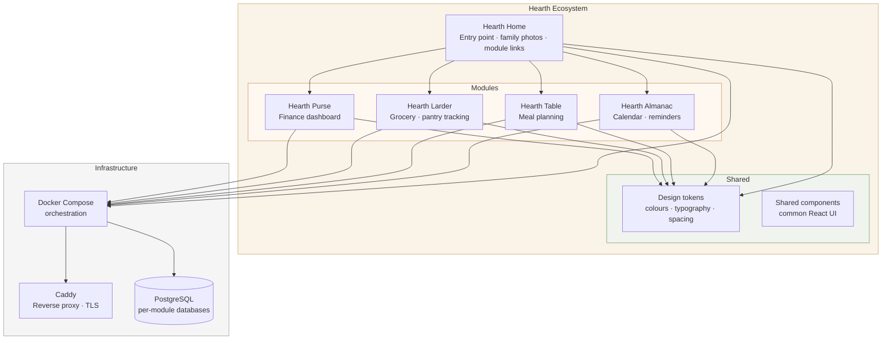

# Hearth — Ecosystem Architecture

**Status:** Living document  
**Last updated:** June 2026  
**Maintainer:** John Soto

---

## Table of Contents

1. [What is Hearth?](#1-what-is-hearth)
2. [Ecosystem Overview](#2-ecosystem-overview)
3. [Repository Structure](#3-repository-structure)
4. [Shared Infrastructure](#4-shared-infrastructure)
5. [Modules](#5-modules)
   - [Hearth Purse](#51-hearth-purse)
   - [Hearth Larder](#52-hearth-larder)
   - [Hearth Table](#53-hearth-table)
   - [Hearth Almanac](#54-hearth-almanac)
   - [Hearth Home](#55-hearth-home)
6. [Naming Philosophy](#6-naming-philosophy)
7. [Design Language](#7-design-language)
8. [Adding a New Module](#8-adding-a-new-module)
9. [Scaling Considerations](#9-scaling-considerations)

---

## 1. What is Hearth?

Hearth is a personal home management ecosystem — a suite of small, well-made
tools for household life, built gradually for family use. Each module solves a
real, recurring problem: understanding where the money goes, knowing what's in
the kitchen, planning the week's meals, remembering what's coming up before it
creeps up on you.

The guiding principle is reducing the invisible cognitive load of running a
household — quietly and reliably, without the noise and misaligned incentives
of commercial alternatives.

Hearth is not a product. It is not trying to scale. It is built for one
household, with the care that comes from actually living with the thing you
are building.

---

## 2. Ecosystem Overview



### Module summary

| Module | Purpose | Status |
|---|---|---|
| **Hearth Purse** | Household finance dashboard — YNAB sync, ML categorisation, cashflow, forecasting | In development |
| **Hearth Larder** | Pantry and grocery tracking — stock levels, shopping lists, waste reduction | Concept |
| **Hearth Table** | Meal planning — weekly plans, recipe linking, Larder integration | Concept |
| **Hearth Almanac** | Calendar intelligence — surfaces upcoming events with household-relevant reminders | Concept |
| **Hearth Home** | Ecosystem entry point — landing page, family photo display, module navigation | Future frontend phase |

---

## 3. Repository Structure

```
hearth/                              # Monorepo root
│
├── purse/                           # Hearth Purse — finance dashboard
│   ├── backend/                     # FastAPI, PostgreSQL, ML pipeline
│   ├── frontend/                    # React, TypeScript, Vite
│   └── docs/                        # Module-specific documentation
│       ├── SPEC.md                  # Full build specification
│       └── ARCHITECTURE.md          # Module architecture detail
│
├── larder/                          # Hearth Larder — pantry/grocery tracking
│   ├── backend/                     # (future)
│   ├── frontend/                    # (future)
│   └── docs/
│       └── SPEC.md                  # Spec when module planning begins
│
├── table/                           # Hearth Table — meal planning
│   ├── backend/                     # (future)
│   ├── frontend/                    # (future)
│   └── docs/
│       └── SPEC.md
│
├── almanac/                         # Hearth Almanac — calendar/reminders
│   ├── backend/                     # (future)
│   ├── frontend/                    # (future)
│   └── docs/
│       └── SPEC.md
│
├── home/                            # Hearth Home — ecosystem entry point
│   └── frontend/                    # (future — Hearth frontend v2)
│
├── shared/                          # Shared across all modules
│   ├── design-tokens/
│   │   ├── colours.css              # CSS custom properties
│   │   ├── typography.css
│   │   ├── spacing.css
│   │   └── index.css                # Imports all tokens
│   └── components/                  # Shared React components (when needed)
│
├── docker-compose.yml               # Production orchestration
├── docker-compose.dev.yml           # Local development overrides
├── Caddyfile                        # Reverse proxy routing for all modules
├── .env.example                     # Environment variable template
├── .gitignore
└── ARCHITECTURE.md                  # This document
```

---

## 4. Shared Infrastructure

All modules run within a single Docker Compose stack, sharing networking,
a reverse proxy, and infrastructure conventions. Each module is independently
deployable within that stack.

### Docker Compose pattern

Each module contributes its own service blocks to `docker-compose.yml`.
A module typically adds:

```yaml
  purse-backend:
    build: ./purse/backend
    environment:
      DATABASE_URL: postgresql+asyncpg://...@postgres:5432/purse
    depends_on:
      - postgres
    restart: unless-stopped

  purse-frontend:
    build: ./purse/frontend
    restart: unless-stopped
```

### Reverse proxy (Caddy)

Caddy handles routing, HTTPS (automatic via Let's Encrypt), and authentication.
Each module gets its own subdomain or path prefix:

```
# Caddyfile sketch
hearth.yourdomain.com {
    basicauth * { ... }

    handle /purse/* {
        reverse_proxy purse-frontend:3000
    }
    handle /purse/api/* {
        reverse_proxy purse-backend:8000
    }

    # Future modules added here as they are built
    handle {
        reverse_proxy home-frontend:3000
    }
}
```

### Database

Each module has its own PostgreSQL database within the shared Postgres instance,
providing logical separation without the operational overhead of separate
database servers:

| Module | Database name |
|---|---|
| Hearth Purse | `hearth_purse` |
| Hearth Larder | `hearth_larder` |
| Hearth Table | `hearth_table` |
| Hearth Almanac | `hearth_almanac` |

### Authentication

Current: HTTP Basic Auth via Caddy, shared household credentials.

Future (when per-user access is needed): JWT auth service, either as a shared
FastAPI module or a lightweight dedicated service. This is an additive change
— the Caddy Basic Auth layer is removed and replaced, no module code changes
required beyond adding a JWT dependency check to each backend.

### Shared design tokens

All module frontends reference `shared/design-tokens/index.css`, which is the
single source of truth for the Hearth visual language. Tailwind in each module
is configured to use these tokens as its palette. This ensures visual
consistency across modules without duplicating values.

---

## 5. Modules

---

### 5.1 Hearth Purse

**Purpose:** Household finance dashboard. Replaces manual bank CSV downloads
with automated YNAB API sync. Provides cashflow visualisation, ML-assisted
transaction categorisation, budget tracking, anomaly detection, and forecasting.

**Status:** In active development (v2)

**Stack:** Python · FastAPI · PostgreSQL · SQLAlchemy · Alembic · scikit-learn ·
React · TypeScript · Vite · Tailwind · react-plotly.js

**Data source:** YNAB API (transactions synced from Nationwide via existing
paid integration)

**Key design decisions:**
- YNAB-approved transactions form the ML training corpus — human-labelled data
  accumulates automatically through normal YNAB usage
- `category_source` field tracks whether a categorisation came from YNAB,
  the ML model, or a manual override — foundation for future SHAP explainability
- APScheduler runs the YNAB sync inside the FastAPI process; extract to a
  separate worker only if stability issues arise
- Polars migration of the data pipeline is planned but deferred — sklearn
  compatibility requires a pandas boundary regardless

**Documentation:**
- `purse/docs/SPEC.md` — full build specification and phased plan
- `purse/docs/ARCHITECTURE.md` — module architecture detail (Mermaid diagrams,
  class diagrams, API endpoint reference)

**Future additions (planned):**
- SHAP explainability for ML predictions (v2.1)
- Prophet time series forecasting (v3, after sufficient data accumulation)
- Forecast backtesting with real accuracy metrics
- Polars in the data pipeline

---

### 5.2 Hearth Larder

**Purpose:** Pantry and grocery tracking. Know what you have, reduce waste,
generate shopping lists from what's running low.

**Status:** Concept — folder scaffolded, spec not yet written

**Likely integrations:**
- Hearth Table (meal plans deplete larder stock)
- Manual entry UI (barcode scanning a possible later addition)

**Notes:** The name *Larder* is deliberately old English — a cool room where
food was stored before refrigeration. Fits the Hearth aesthetic precisely.

**Documentation:** `larder/docs/SPEC.md` — to be written when module planning begins

---

### 5.3 Hearth Table

**Purpose:** Weekly meal planning. Choose meals for the week, link to recipes,
integrate with Larder to know what ingredients you already have.

**Status:** Concept — folder scaffolded, spec not yet written

**Likely integrations:**
- Hearth Larder (ingredient availability)
- Possible recipe import from URL (parse structured recipe data)

**Notes:** Depends naturally on Larder existing first — meal planning without
pantry awareness is less useful. Table should be planned and built after Larder
reaches a usable state.

**Documentation:** `table/docs/SPEC.md` — to be written when module planning begins

---

### 5.4 Hearth Almanac

**Purpose:** Calendar intelligence. Surfaces upcoming events with
household-relevant context and reminders before they creep up — "Aine's
friend's birthday party in 3 weeks" becomes a proactive prompt, not a
last-minute panic.

**Status:** Concept — folder scaffolded, spec not yet written

**Likely integrations:**
- Google Calendar API (OAuth, both household members' calendars)
- Hearth Purse (budget prompt alongside gift/event reminders)
- Notification delivery: email digest or dashboard widget

**Technical shape (provisional):**
- FastAPI backend with Google Calendar OAuth flow
- APScheduler running daily event horizon checks
- Rules engine: event keywords or tags trigger reminder types
- Delivery via email (simplest) or a push to the Hearth Home dashboard widget

**Notes:** The integration with Purse is particularly interesting — an upcoming
birthday in the calendar could surface a budget prompt in the finance view.
Cross-module communication at this level should be via internal API calls,
not shared database access.

**Documentation:** `almanac/docs/SPEC.md` — to be written when module planning begins

---

### 5.5 Hearth Home

**Purpose:** The ecosystem entry point. A landing page that links to all
active modules and serves as the household dashboard at a glance. The design
concept is a warm, textured page evoking a hearth — with picture frames
displaying family photos, each frame or element linking to a Hearth module.

**Status:** Future frontend phase — planned after Hearth Purse v2 is complete

**Design concept:**
- The page is styled to evoke looking at a hearth — warm, centred, a focal point
- Picture frames are displayed as page elements, showing images from the family
  photo collection — swappable, personal
- Each Hearth module is accessible as a distinct visual element on the page
- Family photos can be updated through a simple admin interface

**Technical shape (provisional):**
- Standalone React application in `home/frontend/`
- References shared design tokens from `shared/design-tokens/`
- Photo storage: local filesystem or object storage (Hetzner Object Storage)
- No backend required initially — static React app served by Caddy

**Notes:** This is effectively Hearth Frontend v2 and warrants its own focused
build phase. It should not block the functional work on individual modules. The
picture frame concept — swappable family photos as part of the UI — is an
intentionally personal touch that reflects what Hearth is: a household tool,
not a product.

**Documentation:** `home/docs/SPEC.md` — to be written when this phase begins

---

## 6. Naming Philosophy

Hearth module names are deliberately old English and domestic. They should feel
discovered rather than invented — words that already existed for household things,
repurposed as names for tools that manage those same things.

| Name | Origin | Why it fits |
|---|---|---|
| Hearth | The fireplace and surrounding area; centre of the home | The ecosystem name. Where household life is managed. |
| Purse | A personal money holder; household finances | Old word for money management, personal and domestic |
| Larder | A cool room for storing food | Exactly what the module tracks |
| Table | Where the household eats together | Meal planning, the family table |
| Almanac | An annual calendar of days, seasons, and events | Tracking time and what's coming |

New modules should follow this convention. The name should be a word that
already meant something domestic before software existed.

---

## 7. Design Language

The Hearth visual language applies across all modules. Full detail is in
`shared/design-tokens/` and in each module's frontend documentation. The
principles are:

**Warm, not clinical.** Parchment and earthy tones rather than the cold blues
of fintech and productivity software. The palette should feel like it belongs
in a home.

**Unhurried, not dense.** Generous whitespace. Nothing competing for attention.
The data tells the story; the design holds it quietly.

**Character, not convention.** A serif or humanist typeface for headings.
Something with personality, suggesting craft. Clean sans-serif for data and
body text where legibility matters most.

**Personal, not generic.** Every design decision should be tested against one
question: *does this feel like it belongs in our home?*

### Colour direction

| Role | Direction |
|---|---|
| Background | Warm off-white, parchment, linen — never pure white |
| Accents | Terracotta, forest green, ochre, deep teal |
| Dark mode | Deep walnut or charcoal — warm, not pure black |
| Data/charts | Warm palette; avoid electric blues and greens |

### Typography direction

| Role | Direction |
|---|---|
| Headings | Serif or humanist — Lora, Playfair Display, Fraunces, Source Serif |
| Body / data | Clean readable sans-serif — Inter, DM Sans |
| Scale | Sized for reading, not scanning — generous line height |

---

## 8. Adding a New Module

When a new Hearth module is ready to begin:

1. **Create the folder structure**
   ```
   mkdir -p newmodule/{backend,frontend,docs}
   touch newmodule/docs/SPEC.md
   ```

2. **Write the spec** in `newmodule/docs/SPEC.md` before writing any code.
   Follow the Hearth Purse spec as a template. Settle data model, API shape,
   and phased build plan first.

3. **Add to Docker Compose** — new service blocks for backend and frontend
   following the pattern in Section 4.

4. **Add Caddy routing** — new handle block for the module's subdomain or
   path prefix.

5. **Create the database** — new database in the shared Postgres instance,
   named `hearth_modulename`.

6. **Reference shared design tokens** — configure Tailwind to use
   `shared/design-tokens/index.css` as the palette source.

7. **Update this document** — add the module to the ecosystem overview table
   and write its section under Section 5.

---

## 9. Scaling Considerations

Hearth is intentionally built for personal use. The monorepo and shared
Docker Compose stack is the right architecture at this scale. These notes
document how the architecture would evolve if circumstances changed — for
reference, not as near-term plans.

### If a module needed independent scaling

Extract the module to its own repository and deployment pipeline. The service
boundaries are already clean — each module has its own backend, frontend, and
database. Extraction is a packaging and pipeline change, not a code architecture
change.

### If Hearth became a multi-household product

Each module's backend would need a `user_id` or `household_id` on its data
models. A shared authentication service (JWT, possibly a dedicated FastAPI
service or a lightweight managed solution) would replace Caddy Basic Auth.
Cross-module communication would remain via internal API calls. The monorepo
can remain — it is not the constraint at this scale.

### If modules needed to communicate more deeply

The current approach is internal API calls between module backends (e.g.
Almanac calling Purse to surface a budget prompt alongside a reminder).
If this communication became frequent or complex, a lightweight message
queue (Redis pub/sub, or even a simple Postgres-backed queue) could be
introduced without restructuring the modules themselves.

### On microservices

Splitting into microservices makes sense when teams are independent, when
modules need to scale at different rates, or when clients pick and choose
which components they want. None of those conditions apply to a personal
household tool. The coordination overhead of microservices is real cost
with no benefit at this scale. The architecture is designed so that
microservice extraction is possible if it ever genuinely becomes warranted
— but it should not be done in anticipation of a need that may never arrive.
